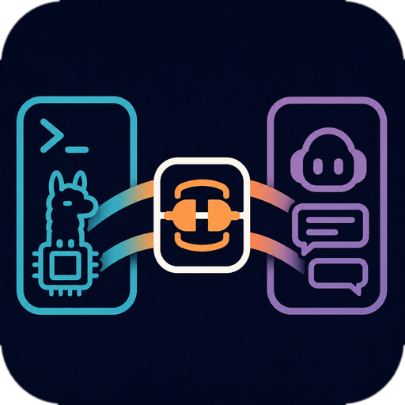
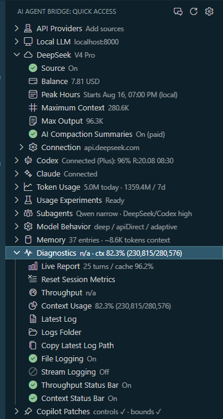
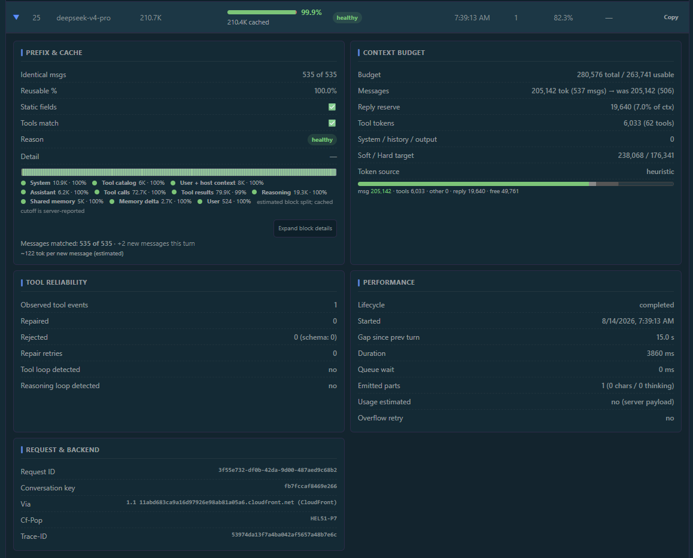
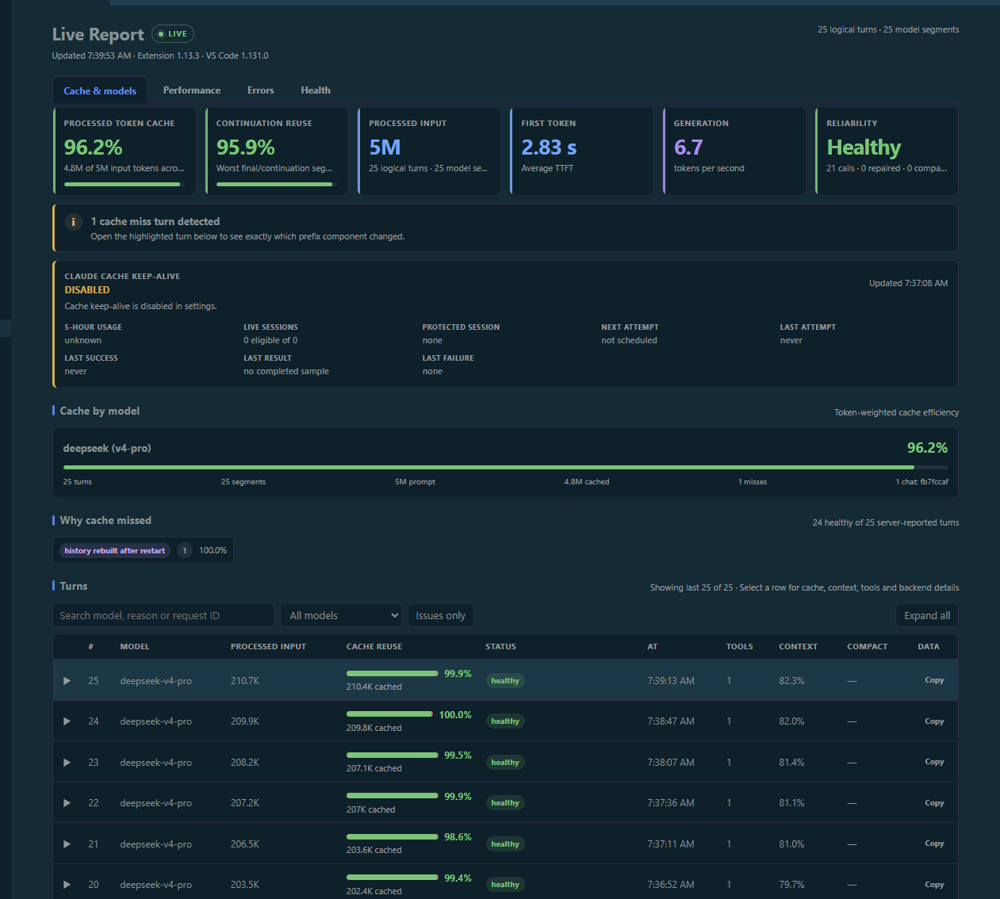
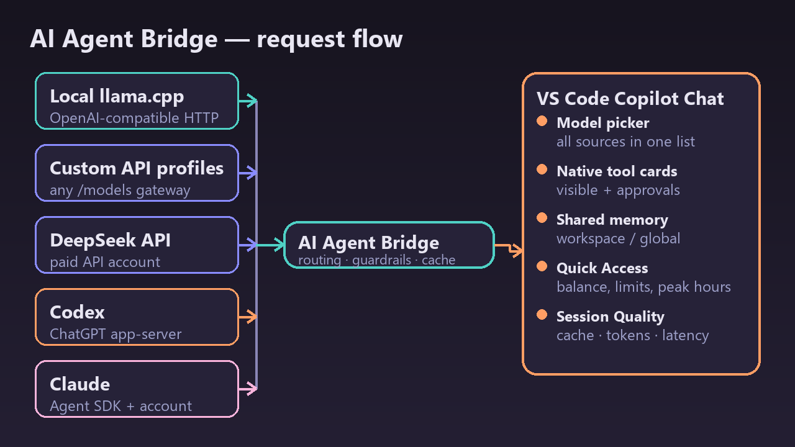

<p align="center"></p>

# AI Agent Bridge for VS Code

**Bridge local models, DeepSeek, Codex, and Claude into one native VS Code agent workflow.**

[](https://github.com/MrLordCat/ai-agent-bridge/releases/latest)
[](https://github.com/MrLordCat/ai-agent-bridge/blob/main/LICENSE)
[](https://github.com/MrLordCat/ai-agent-bridge/actions/workflows/ci.yml)

Every enabled source appears in the normal VS Code model picker. The selected
model keeps the existing Chat UI, workspace context, tool cards, approval
prompts, cancellation, and diagnostics — only the model transport changes:
local llama.cpp, custom OpenAI-compatible APIs, DeepSeek, a ChatGPT-backed
Codex runtime, and Claude Agent SDK sessions all work through the same native
workflow.

> **Measured cache efficiency — 99.3% prompt cache hit.** A real long-running
> DeepSeek v4-pro session (266 turns, 267 segments) sent 36.8M prompt tokens,
> of which 36.5M were served from cache with only 3 misses. Cached input is
> billed at a fraction of uncached input, so prefix-preserving context
> handling directly reduces API cost in long agentic sessions.

## Screenshots

<p align="center"><a href="assets/quick_panel.png" target="_blank"></a></p>

*Quick Access: connected providers, model state, context sliders, balance,
usage limits, memory and diagnostics in one sidebar.*

<p align="center"><a href="assets/turn_details.png" target="_blank"></a></p>

*Session Quality: cache reuse, context-budget allocation, tool reliability,
timings and backend request details for a single turn.*

<p align="center"><a href="assets/Live_report.png" target="_blank"></a></p>

*Live Report: real-time cache efficiency, model performance, reliability and
recent conversation history.*

## Install

The extension ships as a VSIX from GitHub Releases. It is not on the VS Code
Marketplace: the optional Copilot Chat patch is not a Marketplace API, so the
package is deliberately distributed outside the gallery.

1. Download `llama-vscode-chat-v{version}.vsix` from
   [Releases](https://github.com/MrLordCat/ai-agent-bridge/releases/latest).
2. Install it:
   ```sh
   code --install-extension llama-vscode-chat-v1.14.3.vsix
   ```
3. Run `Developer: Reload Window`.

## Quick Start

1. Install the extension and run `Developer: Reload Window`.
2. Open `AI Agent Bridge: Open Sidebar` and enable only the sources you intend to use.
3. Configure the source, run `AI Agent Bridge: Refresh Models`, then select the model
   from the normal VS Code Chat picker.

**Local:** start an OpenAI-compatible server such as `llama-server`, then set
its URL with `AI Agent Bridge: Set Local Server URL`.

**Custom APIs:** open Quick Access → `Providers` → `Providers Manager`,
add a profile, choose its API format and model family, then refresh models. A
base URL may already end in `/v1` (for example `https://openrouter.ai/api/v1`).

**DeepSeek:** run `AI Agent Bridge: Configure DeepSeek`, store the API key in VS Code
SecretStorage, then refresh models.

**Codex:** install the official Codex runtime (the official OpenAI extension can
provide it), then run `AI Agent Bridge: Sign In to Codex Subscription`. API-key auth
does not substitute for the required ChatGPT account mode.

**Claude:** the VSIX includes the supported platform runtime. Sign in, then run
`AI Agent Bridge: Sign In to Claude Subscription`.

**Agents Window (BYOK):** register the model catalog in the VS Code Agents Window without any manual endpoint setup: the extension enables `chat.agentHost.byokModels.enabled` automatically, and the whole catalog — Local, DeepSeek, Codex, Claude, and custom API profiles — appears in the Agents model picker directly through the built-in language-model provider. For a reasoning-effort switch in the Agents model picker, run `AI Agent Bridge: Toggle Thinking Picker Patch` (Quick Access → Copilot Patches → Thinking picker (Agents)) and restart the agent host; the patch also fixes the VS Code 1.131 BYOK loopback proxy for non-streaming SDK requests.

## Model Sources

| Source | Models | Best For |
|---|---|---|
| Local OpenAI-compatible server | Whatever the configured server advertises | Private or high-volume work, local vision-capable models, and bounded mechanical tasks. The server must be running. |
| Custom API profiles | Models returned by each enabled OpenAI-compatible `/models` endpoint | Multiple gateways, vendors, or accounts with independent URLs, credentials, request formats, model families, and context limits. Implemented for OpenAI-compatible endpoints; not yet field-tested against third-party gateways. |
| DeepSeek API | Models returned by the configured DeepSeek endpoint | API-backed reasoning and implementation with explicit key storage and usage tracking. |
| Codex (ChatGPT account) | Models discovered from the installed Codex app-server | Subscription-backed coding with configurable reasoning effort and native VS Code tools. The catalog can change with account and runtime availability. |
| Claude (Agent SDK) | Supported Claude subscription profiles | Long-running analysis, implementation, and review through durable Agent SDK sessions. |

All sources appear together in the native picker. Custom entries use the profile
name you assign; built-in entries retain `(Local)`, `(DeepSeek)`, `(Codex)`, and `(Claude)`.
Internal prefixes route requests, never sent upstream.

## How It Compares

| | AI Agent Bridge | Continue | Cline / Roo Code |
|---|---|---|---|
| Where it runs | Inside VS Code Copilot Chat | Own sidebar UI | Own agent UI |
| Model sources | Local llama.cpp, custom OpenAI-compatible APIs, DeepSeek, Codex (ChatGPT), Claude | Local + cloud APIs | Any API |
| Subscription accounts (ChatGPT / Claude) | Yes — official runtimes | No | No |
| Tools & approvals | Native VS Code tool cards and approval policy | Own tools | Own tools, auto-approve mode |
| Usage and cache diagnostics | Live Report, Session Quality, token history | Basic | Basic |
| Distribution | VSIX from GitHub Releases | Marketplace | Marketplace |

If you want a separate chat UI or a general API-only agent, those tools are
great. AI Agent Bridge is for keeping the native Copilot Chat workflow while
adding local models, subscription providers, and per-request cost/cache
visibility.

## What the Extension Is For

The project has five concrete goals:

1. **Use one editor workflow for different compute sources.** Move between a
   local OpenAI-compatible server, multiple independent API gateways/accounts,
   DeepSeek API models, a ChatGPT-backed Codex runtime, and Claude Agent SDK
   sessions without replacing the global Copilot endpoint.
2. **Keep actions visible and controlled by VS Code.** Subscription runtimes do
   not receive a hidden shell or file-edit backdoor. Model actions return as
   native tool calls and use the active VS Code approval policy.
3. **Avoid unnecessary context replay and cache misses.** Stable tool catalogs,
   deterministic schemas, bounded tool results, compaction, and durable provider
   sessions preserve reusable prefixes and reduce repeated input.
4. **Expose what the model actually consumed.** The live Session Quality report
   tracks token/cache snapshots, context and compaction, model segments, native
   tool steps, latency, and reliability signals without storing message bodies.
5. **Fail closed at integration boundaries.** Unsupported internal actions,
   stale sessions, incompatible patches, and credential mismatches are rejected
   instead of silently falling back to a less controlled path.

## Capabilities

| Capability | What it provides |
|---|---|
| Unified model picker | Local, custom API, DeepSeek, Codex, and Claude models appear beside other VS Code Chat models. Provider prefixes route requests internally and are never sent upstream. |
| Central API Provider Manager | A dedicated Quick Access webview can add, edit, enable, disable, and delete multiple OpenAI-compatible endpoints/accounts. Metadata is global; each API key stays in VS Code SecretStorage. |
| Native agent tools | File, search, terminal, diagnostics, MCP, and other registered tools execute through VS Code tool cards with normal confirmation and cancellation behavior. Availability still depends on the current VS Code/Copilot installation and workspace policy. |
| Model-specific reasoning controls | Local thinking modes, DeepSeek reasoning, Codex effort levels such as `xhigh`, and Claude thinking profiles are mapped to the selected backend. |
| Durable subscription sessions | Codex threads and Claude sessions persist in `workspaceState`, can reattach after reload, and can continue in a clean chat when the visible transcript becomes too large. |
| Cache-aware context handling | Deterministic tool/schema ordering, exact continuation matching, bounded results, and provider-aware compaction reduce prefix churn and oversized cold starts. Local/DeepSeek HTTP history can compact to 25–90% retained. Long DeepSeek sessions reach 99%+ prompt cache hit (measured 99.3% over 266 turns). |
| Semantic compaction | An opt-in paid `deepseek-v4-flash` pass merges a deterministic turn digest into a structured engineering handoff while preserving objectives, decisions, verification, failed approaches, and exact next work. |
| Manual recovery compaction | For AI Agent Bridge models, Copilot's native **Compact Conversation** button creates a provider-owned clean snapshot immediately. It summarizes every old turn, removes historical reasoning/repetition poison, and keeps Copilot's native behavior for other providers. |
| Reasoning loop recovery | Exact multi-kilobyte repetition in streamed private reasoning is stopped, the poisoned chain is rebuilt as a clean provider summary, and one bounded retry continues from the last verified state. |
| Shared memory | Workspace, project, and global memory can be retrieved by models through explicit native tools and inspected from Quick Access. |
| Live diagnostics | Provider Health checks connectivity; Session Quality covers Local, DeepSeek, Codex, and Claude turns and shows model/tool steps, provider-specific cache, usage, latency, context, and compaction; Usage Experiments compare matched baseline and delegated tasks. |
| Guarded Copilot integration | Patch v22 adds controls absent from the stable provider API, routes manual recovery compaction, preserves an exact backup, validates bundle compatibility, and can restore the original bundle. |

## How Requests Flow

<p align="center"></p>

### HTTP API sources (Local, DeepSeek, and custom profiles)

```text
VS Code Chat model picker
  -> LanguageModelChatProvider
  -> OpenAI-compatible HTTP transport
  -> streamed text / reasoning / tool calls
  -> native VS Code tool cards
```

### Codex selected from the model picker

Selecting a Codex model such as GPT-5.6 Sol with `xhigh` uses the normal model
provider path; it does not create a separate `@codex` participant:

```text
VS Code Chat + selected Codex model
  -> this extension's Codex provider
  -> official local codex app-server and ChatGPT account
  -> Codex dynamic tool request
  -> native VS Code tool card/execution
  -> tool result resumes the same app-server turn
```

VS Code may re-enter the provider after a tool result, but the extension keeps
the original Codex thread and app-server turn alive. Internal Codex shell,
file-change, web, MCP, browser, plugin, image, and subagent actions are blocked;
the advertised VS Code tool catalog is the action surface.

### Claude selected from the model picker

Claude uses the Agent SDK with only the native VS Code MCP server allowlisted.
The SDK session is durable, while file, terminal, search, and other operations
remain visible in the editor's tool workflow.

```text
VS Code Chat + selected Claude model
   -> persistent Claude Agent SDK Query
   -> allowlisted mcp__vscode__* tool request
   -> native VS Code tool card/execution
   -> tool result resolves the same SDK MCP call
   -> the same Query continues
```

Session Quality keeps one logical row across those continuations and separates
fresh input, cache reads, cache creation, output, and thinking tokens. It also
shows Agent SDK session mode, model/tool steps, native tool duration, terminal
lifecycle, and the asynchronous SDK context-category snapshot.

Native Copilot Chat Session Info receives the final Claude model segment as its
current context occupancy, with cache reads exposed as cached prompt tokens.
Live Report intentionally keeps the aggregate processed usage across all Agent
SDK model segments, so its billing/work total can be larger than the native
current-context value without indicating a context overflow.

## Typical Workflows

- Use a local model for private or high-volume mechanical work, and delegate a
  bounded reasoning task to DeepSeek when its API is configured.
- Connect OpenAI, OpenRouter, or another compatible gateway as independent API
  profiles and switch among their discovered models without replacing the
  built-in local or DeepSeek source.
- Use Codex with a high reasoning effort for implementation while retaining the
  same VS Code tools and approval cards used by other contributed models.
- Resume a durable Codex or Claude provider session in a clean chat instead of
  replaying an oversized editor transcript.
- Compare cache and token behavior before and after routing changes with matched
  Usage Experiments and the live Session Quality report.

## Important Commands

| Command | Purpose |
|---|---|
| `AI Agent Bridge: Open Sidebar` | Quick Access with connections, provider context sliders, behavior, memory, diagnostics |
| `AI Agent Bridge: Providers Manager` | One place for every source: Local LLM, DeepSeek, Codex, Claude, and custom API profiles, with live availability and offline reasons |
| `AI Agent Bridge: Refresh Models` | Refresh every enabled source |
| `AI Agent Bridge: Configure DeepSeek` | Store DeepSeek API key |
| `AI Agent Bridge: Sign In to Codex Subscription` | Authenticate Codex app-server |
| `AI Agent Bridge: Sign In to Claude Subscription` | Authenticate Claude Code runtime |
| `AI Agent Bridge: Continue Latest Codex Thread in New Chat` | Resume durable Codex thread in clean transcript |
| `AI Agent Bridge: Continue Latest Claude Session in New Chat` | Resume durable Claude session in clean transcript |
| `AI Agent Bridge: Run Provider Health Check` | Probe all sources and runtime features |
| `AI Agent Bridge: Open Session Quality Report` | Live cache, usage segments, model/tool steps, latency, context, compaction, and reliability |
| `AI Agent Bridge: Start Baseline Usage Experiment` | Record the baseline side of a matched usage comparison |
| `AI Agent Bridge: Start Delegated Usage Experiment` | Record the delegated side of a matched usage comparison |
| `AI Agent Bridge: Open Shared Memory` | Inspect/edit durable shared memory |
| `AI Agent Bridge: Apply Copilot Chat Patch` | Enable native Thinking Effort, context budgets, session resume |
| `AI Agent Bridge: Restore Original Copilot Chat` | Restore exact pre-patch bundle backup |

All settings use `llamacpp.*`. Source availability, tool catalogs, and approval
behavior remain subject to the installed VS Code/Copilot versions, workspace
trust and policy, account entitlements, and enabled connectors/MCP servers.

## Security and Data Boundaries

- DeepSeek and custom API keys are stored in VS Code SecretStorage; profile
  metadata contains no credentials, saved keys are never displayed by the
  manager, and logs redact authorization headers.
- Codex and Claude authentication is owned by their official runtimes. This
  extension asks those runtimes for account status and never reads credential
  files directly.
- Codex internal action items are denied. Claude tools are restricted to the
  allowlisted native VS Code MCP namespace.
- Session-quality records contain metrics and identifiers, not prompt or tool
  result bodies. Compaction diagnostics separately keep bounded summary/tail
  samples for quality audits. Reports are written to extension-owned global storage.
- The optional Copilot patch changes a versioned installed bundle. It is not a
  Marketplace API, so every update must be revalidated; the command creates a
  backup and `Restore Original Copilot Chat` reverses it.

## Known Boundaries

- This extension does not grant ChatGPT, Claude, connector, plugin, MCP, or
  workspace-policy entitlements. Authentication and feature availability are
  evaluated independently for each surface.
- A configured but offline local server will fail its health check; it does not
  affect working subscription providers.
- Durable provider sessions reduce replay, but the VS Code-visible transcript
  can still grow. Use the explicit Continue Latest command when a clean chat is
  needed.
- Model IDs and service limits are discovered at runtime and should not be
  treated as a permanent catalog promised by the extension.
- Custom API profiles currently target OpenAI-compatible Bearer-token services
  with `/models` and streaming `/chat/completions`. The flow is implemented and
  covered by unit tests, but has not been exercised end-to-end against real
  third-party gateways yet. Vendor-specific schemes such as Azure `api-key`
  headers/deployment URLs require a future compatibility profile.
- DeepSeek semantic summaries are opt-in paid API calls. Deterministic local
  summarization remains the fallback when disabled or unavailable.
- A 25% compaction target is intentionally aggressive: fixed system, tool,
  memory, and reply-reserve costs mean total prompt occupancy remains higher.

## Documentation

| Document | Contents |
|---|---|
| [Architecture](docs/ARCHITECTURE.md) | Runtime boundaries, request flow, invariants |
| [API Providers](docs/API_PROVIDERS.md) | Multi-endpoint setup, request formats, storage, and compatibility boundaries |
| [Codex Subscription](docs/CODEX_SUBSCRIPTION.md) | Authentication, app-server flow, security model |
| [Claude Subscription](docs/CLAUDE_SUBSCRIPTION.md) | Agent SDK sessions, native VS Code tools, cache/context metrics |
| [Copilot Chat Integration](docs/COPILOT_PATCH.md) | Patch mechanics, auto-update, fail-closed guarantees |
| [Tokens, Reasoning, and Cache](docs/TOKENS_REASONING_CACHE.md) | Context budgets, thinking modes, cache behaviour |
| [Shared Memory](docs/MEMORY.md) | Scopes, retrieval, persistence, Agent tools |
| [Reliability and Diagnostics](docs/RELIABILITY_DIAGNOSTICS.md) | Tool validation, health checks, session reports |
| [Agent Tools Guide](docs/AGENT_TOOLS_GUIDE.md) | Compact CLI workflows for agent sessions |
| [Knowledge Verification](docs/KNOWLEDGE_VERIFICATION.md) | Source policy, cache-stable instructions |
| [Project Audit](docs/AUDIT.md) | Quality gates, refactoring status, residual risks |

## Development

**Stable release: 1.14.3. Current local development build: 1.14.13.** The
stable line consolidates the 1.13.x development patches: Claude follow-up
messages are forwarded to the resumed session, the active-turn timeout is
300 s with a pending-tool guard, DeepSeek peak-hours billing is shown in
Quick Access, and the README is now a full storefront with branding,
screenshots, and measured cache-hit numbers.

```sh
npm install
npm run compile
npm run lint
npm test              # 415 extension-host tests in the current 1.14.13 dev patch
npm run package       # → llama-vscode-chat-{version}.vsix
code --install-extension ./llama-vscode-chat-{version}.vsix --force
```

The independent extension id is `mrlordcat.llama-vscode-chat`. Originally a
fork of a llama.cpp provider, it is now an independent extension; the
`llamacpp.*` setting and command namespace remains for compatibility.
Creating a Git tag or publishing a release is intentionally separate from
building a local VSIX; see `scripts/stable-release.sh` for the clean-tree gate.

## License

[MIT](LICENSE)

## References

- [llama.cpp](https://github.com/ggerganov/llama.cpp)
- [DeepSeek API](https://api-docs.deepseek.com/)
- [VS Code Extension API](https://code.visualstudio.com/api)
